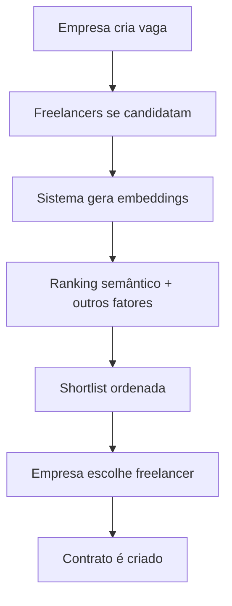
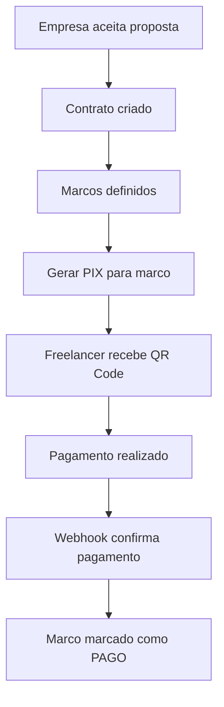
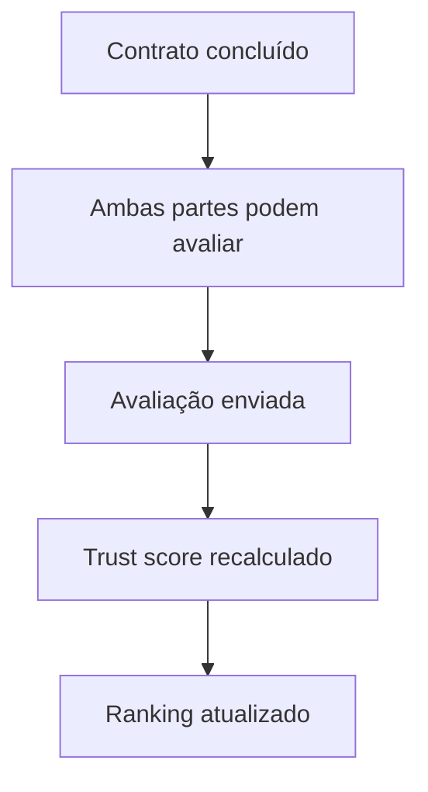

# 🚀 Hire-Fastly

> **Plataforma de Freelancing Inteligente com Matching Semântico**

Uma plataforma moderna que conecta empresas e freelancers usando inteligência artificial para criar matches perfeitos baseados em compatibilidade semântica, skills e trust score.


## ✨ Características Principais

- 🧠 **Matching Semântico** - IA analisa descrições e skills para encontrar matches perfeitos
- 💰 **Sistema de Pagamentos** - Integração PIX com múltiplos PSPs (ASAAS, Pagar.me, MercadoPago)
- ⭐ **Trust Score** - Sistema de avaliações que influencia o ranking
- 🔒 **Verificação de Usuários** - Níveis de verificação (email, documentos, testes técnicos)
- 💬 **Chat Integrado** - Comunicação segura com detecção de tentativas off-platform
- 🌙 **Dark Mode** - Interface moderna com tema claro/escuro
- 📊 **Analytics** - PostHog para tracking de eventos e funil de conversão

## 🏗️ Arquitetura

### Frontend
- **React 18** com TypeScript
- **Vite** para build e desenvolvimento
- **Tailwind CSS** para estilização
- **Shadcn/ui** para componentes
- **React Router** para navegação
- **React Query** para cache e sincronização

### Backend
- **Supabase** como BaaS (Backend as a Service)
- **PostgreSQL** com extensões (pgvector, uuid)
- **Edge Functions** (Deno runtime)
- **Row Level Security (RLS)** para segurança

### Integrações
- **PostHog** para analytics
- **DOMPurify** para sanitização
- **Lucide React** para ícones

## 📊 Fluxos Principais

### 1. 🎯 Fluxo de Matching (Shortlist)



**Algoritmo de Ranking:**
- 40% - Compatibilidade semântica (cosine similarity)
- 25% - Overlap de skills
- 15% - Nível de senioridade
- 10% - Fit de preço
- 5% - Disponibilidade
- 5% - Trust score

### 2. 💰 Fluxo de Pagamentos



**Estrutura de Taxas:**
- Taxa da plataforma: 10% sobre cada marco
- Valor bruto = Valor do marco + Taxa
- Valor líquido = Valor do marco

### 3. ⭐ Fluxo de Avaliações



## 🗄️ Modelo de Dados

### Principais Tabelas

```sql
-- Usuários e Perfis
profiles (id, name, email, role, trust_score, verif_level)
freelancer_profiles (user_id, skills, seniority, rate_hour, ...)
company_profiles (user_id, display_name, industry, verified, ...)

-- Jobs e Propostas
jobs (id, company_id, title, description, skills, budget, model, ...)
proposals (id, job_id, freela_id, message, price, status, ...)
shortlist (job_id, freela_id, rank, score_json)

-- Contratos e Pagamentos
contracts (id, job_id, proposal_id, company_id, freela_id, ...)
milestones (id, contract_id, description, value, status, ...)
payments (id, milestone_id, gross_value, platform_fee, provider, ...)

-- Sistema de Reviews
reviews (id, contract_id, author_id, target_id, rating, text)
```

### Extensões PostgreSQL
- `uuid-ossp` - Geração de UUIDs
- `vector` - Armazenamento de embeddings (768 dimensões)

## 🔌 APIs e Endpoints

### Edge Functions (Supabase)

#### Autenticação e Usuários
- `POST /auth/v1/signup` - Cadastro de usuário
- `POST /auth/v1/token` - Login
- `GET /rest/v1/profiles` - Perfil do usuário

#### Jobs e Propostas
- `GET /rest/v1/jobs` - Listar vagas
- `POST /rest/v1/jobs` - Criar vaga
- `POST /functions/v1/create-proposal` - Enviar proposta
- `GET /rest/v1/shortlist` - Ver shortlist

#### Contratos e Pagamentos
- `POST /functions/v1/create-contract` - Criar contrato
- `POST /functions/v1/milestone-checkout` - Gerar PIX
- `POST /functions/v1/payment-webhook` - Webhook de pagamento

#### Reviews e Trust Score
- `POST /functions/v1/create-review` - Criar avaliação
- `GET /functions/v1/get-reviews` - Listar avaliações
- `POST /functions/v1/update-trust-score` - Atualizar trust score

#### Embeddings e IA
- `POST /functions/v1/embed-job` - Gerar embedding para vaga
- `POST /functions/v1/embed-profile` - Gerar embedding para perfil

#### Chat e Comunicação
- `POST /functions/v1/send-message` - Enviar mensagem
- `GET /rest/v1/messages` - Buscar mensagens

## 🛡️ Segurança e Compliance

### Row Level Security (RLS)
- Usuários só acessam seus próprios dados
- Empresas só veem propostas de suas vagas
- Freelancers só veem suas próprias propostas

### Rate Limiting
- Token bucket algorithm
- Limite de propostas por freelancer
- Limite de mensagens por minuto

### LGPD Compliance
- Política de privacidade
- Termos de serviço
- Consentimento explícito no cadastro

### Detecção Off-Platform
- Regex para detectar tentativas de comunicação externa
- Alertas educativos para usuários

## 🚀 Como Executar

### Pré-requisitos
- Node.js 18+
- npm ou yarn
- Conta no Supabase

### Instalação

```bash
# Clone o repositório
git clone https://github.com/seu-usuario/hire-fastly.git
cd hire-fastly

# Instale as dependências
npm install

# Configure as variáveis de ambiente
cp .env.example .env.local
# Edite .env.local com suas credenciais do Supabase
```

### Variáveis de Ambiente

```env
VITE_SUPABASE_URL=sua_url_do_supabase
VITE_SUPABASE_ANON_KEY=sua_chave_anonima
SUPABASE_SERVICE_ROLE_KEY=sua_chave_de_servico
POSTHOG_KEY=sua_chave_do_posthog
```

### Desenvolvimento

```bash
# Inicie o servidor de desenvolvimento
npm run dev

# O app estará disponível em http://localhost:5173
```

### Build para Produção

```bash
# Build otimizado
npm run build

# Preview do build
npm run preview
```

### Migrações do Banco

```bash
# Aplique as migrações no Supabase
supabase db push

# Ou via Dashboard do Supabase
```

## 🧪 Testes

```bash
# Executar testes
npm run test

# Testes com coverage
npm run test:coverage
```

## 📈 Monitoramento

### PostHog Events
- `user_signup` - Cadastro de usuário
- `job_created` - Vaga criada
- `proposal_sent` - Proposta enviada
- `contract_signed` - Contrato assinado
- `pix_payment_initiated` - Pagamento PIX iniciado
- `pix_paid` - Pagamento confirmado
- `review_submitted` - Avaliação enviada

### Logs Estruturados
- Todos os webhooks são logados
- Erros são capturados com Sentry
- Performance é monitorada

## 🎨 Design System

### Cores (HSL)
```css
/* Light Mode */
--primary: 217 91% 60%; /* #3B82F6 */
--primary-hover: 217 91% 50%; /* #2563EB */

/* Dark Mode */
--primary: 217 91% 70%; /* Lighter blue */
--primary-hover: 217 91% 60%; /* #3B82F6 */
```

### Componentes
- Todos os componentes seguem o padrão Shadcn/ui
- Responsive design mobile-first
- Acessibilidade (WCAG 2.1)

## 🤝 Contribuição

1. Fork o projeto
2. Crie uma branch para sua feature (`git checkout -b feature/AmazingFeature`)
3. Commit suas mudanças (`git commit -m 'Add some AmazingFeature'`)
4. Push para a branch (`git push origin feature/AmazingFeature`)
5. Abra um Pull Request

## 📝 Roadmap

### Próximas Features
- [ ] Notificações push
- [ ] App mobile (React Native)
- [ ] Integração com mais PSPs
- [ ] Dashboard de analytics avançado
- [ ] Sistema de disputas
- [ ] Marketplace de templates

### Melhorias Técnicas
- [ ] Cache Redis para performance
- [ ] CDN para assets estáticos
- [ ] Testes E2E com Playwright
- [ ] CI/CD automatizado

## 📄 Licença

Este projeto está sob a licença MIT. Veja o arquivo [LICENSE](LICENSE) para mais detalhes.

## 👥 Equipe

- **Desenvolvimento**: [Seu Nome]
- **Design**: [Nome do Designer]
- **Product**: [Nome do PM]

## 📞 Suporte

- 📧 Email: suporte@hire-fastly.com
- 💬 Discord: [Link do servidor]
- 📖 Docs: [Link da documentação]

---

<div align="center">

**Feito com ❤️ para conectar talentos e oportunidades**

[⭐ Deixe uma estrela](https://github.com/seu-usuario/hire-fastly) • [🐛 Reporte um bug](https://github.com/seu-usuario/hire-fastly/issues) • [💡 Sugira uma feature](https://github.com/seu-usuario/hire-fastly/issues)

</div>